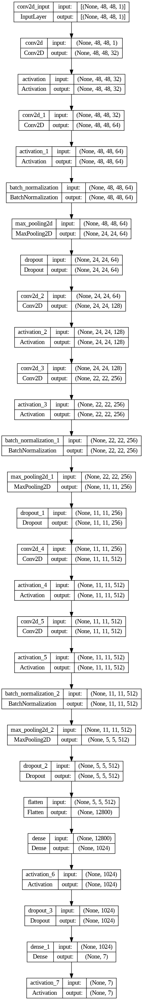
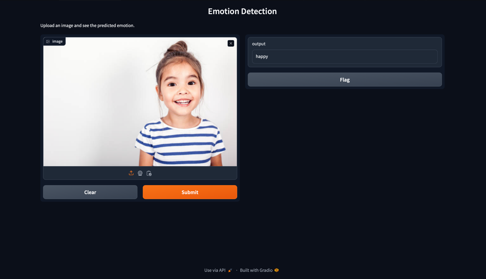
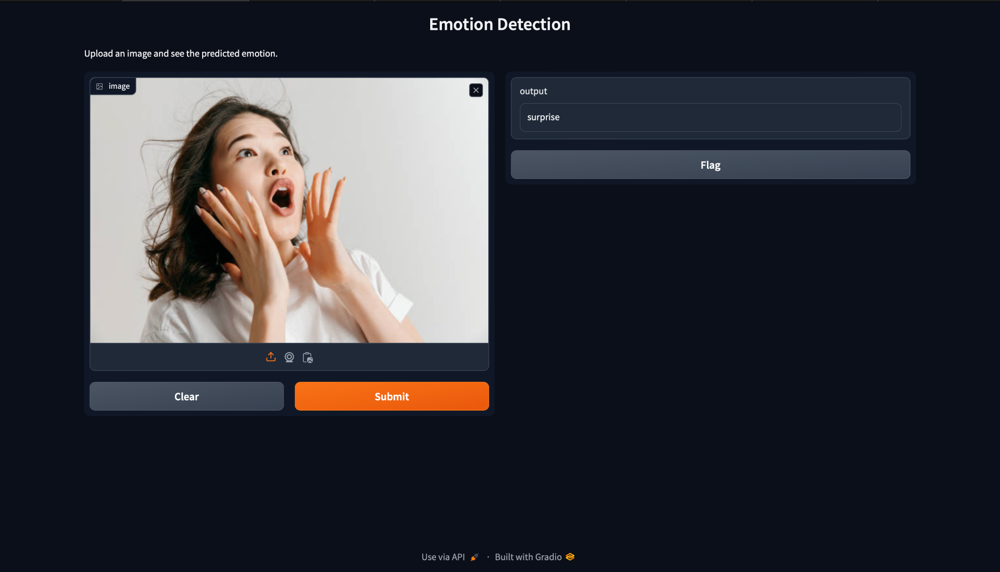

# Emotion Detection Project

This project aims to detect emotions from facial images using deep learning techniques. We implemented four different models using TensorFlow and Keras, utilizing the FER-2013 dataset from Kaggle. The emotions detected are classified into seven categories: 'angry', 'disgust', 'fear', 'happy', 'neutral', 'sad', and 'surprise'.

## Dataset

The dataset used for this project is the FER-2013 dataset, which can be found [here](https://www.kaggle.com/datasets/msambare/fer2013/data). This dataset is imbalanced, particularly for the 'disgust' class. To address this imbalance, we applied class weights during training.

## Class Labels

The emotion classes are encoded as follows:
- 'angry': 0
- 'disgust': 1
- 'fear': 2
- 'happy': 3
- 'neutral': 4
- 'sad': 5
- 'surprise': 6

## Class Weight Computation

We used the `compute_class_weight` function from `sklearn` to add more weights to the 'disgust' class, ensuring the model treats this underrepresented class more fairly during training.

## Models

### Model 1: Custom Sequential Model

The first model was built from scratch using the Sequential API of Keras. The architecture is as follows:



### Model 2: Sequential Model with Image Augmentation

In the second model, we used the same architecture as the first model but incorporated image augmentation using the `ImageDataGenerator` class from Keras to improve model performance and generalization.

### Model 3: VGG16 with Class Weights

For the third model, we utilized the VGG16 architecture pre-trained on ImageNet. We applied the `compute_class_weight` to address class imbalance.

VGG16 is a convolutional neural network architecture that was proposed by K. Simonyan and A. Zisserman from the University of Oxford. It is characterized by its simplicity, using 3x3 convolutional layers stacked on top of each other in increasing depth. VGG16 has 16 weighted layers and was trained on the ImageNet dataset, achieving top results in various image recognition challenges. Despite its success, VGG16 is computationally expensive due to the large number of parameters, which makes it challenging for real-time applications without powerful hardware.

### Model 4: ResNet50

The fourth model used the ResNet50 architecture, which is known for its deep residual learning framework.

ResNet50, short for Residual Networks, was introduced by Kaiming He and his colleagues. It consists of 50 layers and is designed to solve the vanishing gradient problem that hampers the training of deep neural networks. The key innovation of ResNet is the use of residual blocks, which allow the network to learn residual functions with reference to the layer inputs. This architecture enables the training of much deeper networks than previously possible, leading to significant improvements in performance for various image recognition tasks. Despite its advanced design, this model achieved an accuracy of 50%.

## Deployment

We deployed our final model using Gradio, a Python library that allows easy creation of web interfaces for machine learning models. The deployment is live for 72 hours.

### Examples

#### Happy Emotion Detection


#### Surprise Emotion Detection


## Conclusion

This project explored various deep learning models and techniques to detect emotions from facial images. We addressed dataset imbalance, utilized different architectures, and leveraged image augmentation to improve performance.

## Installation and Usage

1. Clone the repository:
   ```sh
   git clone https://github.com/your-repo/emotion-detection.git
   ```
2. Install the required dependencies:
   ```sh
   pip install -r requirements.txt
   ```
3. Run the training script:
   ```sh
   python train.py
   ```
4. To deploy the model using Gradio:
   ```sh
   python app.py
   ```

## Acknowledgements

We thank the contributors of the FER-2013 dataset and the developers of TensorFlow, Keras, and Gradio for providing the tools necessary for this project.

Happy Coding!